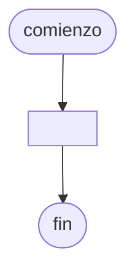

# 20241102 - Elecciones

Se tiene el siguiente [[Archivo]] plano `elecciones.txt` con el resultado de las elecciones presidenciales en Argentina (separador ";"):

- Ciudad (cadena)
- Número de mesa (entero)
- Votos Milei (entero)
- Votos Massa (entero)

El [[Archivo]] ya está ordenado por el campo ciudad. Mostrar:

- Total de votos de Milei por cada ciudad.
- Total de votos de Massa por cada ciudad.
- Ciudad con el mayor total de votos de Milei (no repetido).
- Ciudad con el mayor total de votos de Massa (no repetido).

## Diagrama de flujo



## Código

```embed-python
PATH: "vault://Algoritmos y Estructuras de Datos/python/20241102-elecciones/main.py"
```

```embed-python
PATH: "vault://Algoritmos y Estructuras de Datos/python/20241102-elecciones/elecciones.txt"
```
