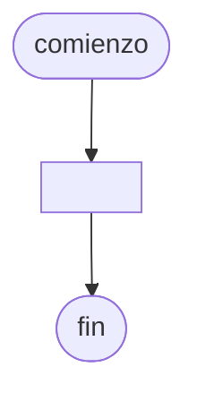

# 20241102 - Eliminar cliente

Tienes un [[Archivo]] llamado `clientes.txt` que almacena [[Información]] de clientes. Cada registro contiene:

- ID de cliente (entero)
- Nombre (cadena)
- Edad (entero)
- Ciudad (cadena)

Implementa un programa que permita al usuario ingresar el ID de un cliente que desea eliminar.

## Diagrama de flujo



## Código

```embed-python
PATH: "vault://Algoritmos y Estructuras de Datos/python/20241102-eliminar-cliente/main.py"
```
