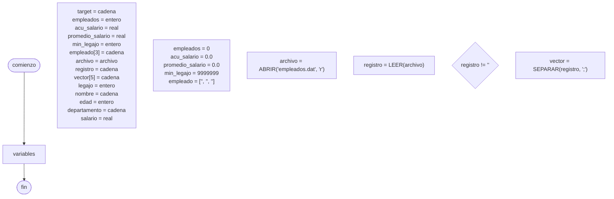

# 20241102 - Empleados

Crea un programa que lea un [[Archivo]] `empleados.dat`, donde cada registro contiene:

- Legajo de empleado (entero)
- Nombre (cadena)
- Edad (entero)
- Departamento (cadena): "a", "b", o "c"
- Salario (real)

El programa debe permitir al usuario ingresar un departamento y mostrar:

- La cantidad de empleados en ese departamento
- El promedio de salario de los empleados en ese departamento
- El nombre, edad y salario del empleado con menor legajo en ese departamento

## Diagrama de flujo



## Código

```embed-python
PATH: "vault://Algoritmos y Estructuras de Datos/python/20241102-empleados/main.py"
```

```embed-python
PATH: "vault://Algoritmos y Estructuras de Datos/python/20241102-empleados/empleados.dat"
```
