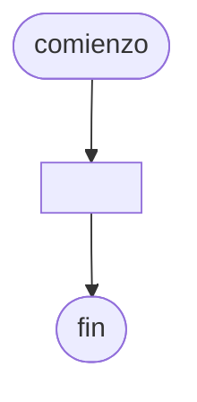

# 20241103 - Almacén

Crea una [[Vector|Lista]] ordenada de 50 números enteros (aleatorios, entre 100 y 999 inclusive) que representa el inventario de identificadores **únicos** de productos en un almacén. Diseña una [[Algoritmos y Estructuras de Datos/Función|Función]] de [[Búsqueda binaria]] que permita al usuario ingresar un número de ID y verifique si existe en el inventario.

El programa debe mostrar la [[Vector|Lista]] generada, luego permitir al usuario ingresar un número, y finalmente mostrar un mensaje que indique si el ID fue encontrado o no, y en qué posición de la [[Vector|Lista]] se encuentra.

## Diagrama de flujo



## Código

```embed-python
PATH: "vault://Algoritmos y Estructuras de Datos/python/20241103-almacen.py"
```
