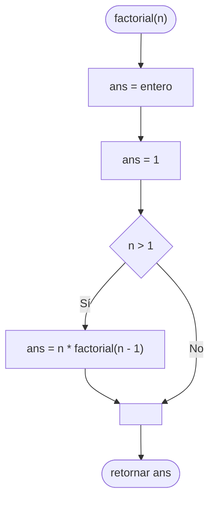

# 20241103 - Factorial

Diseñe una [[Algoritmos y Estructuras de Datos/Función|Función]] [[Algoritmos y Estructuras de Datos/Recursividad|Recursiva]] para calcular el factorial de un número entero pasado como parámetro. Sabemos que:

- El factorial de $0$ es $1$ y el factorial de $1$ es $1$.
- $n! = n \cdot (n - 1)!$.

## Diagrama de flujo



## Código

```embed-python
PATH: "vault://Algoritmos y Estructuras de Datos/python/20241103-factorial.py"
```
