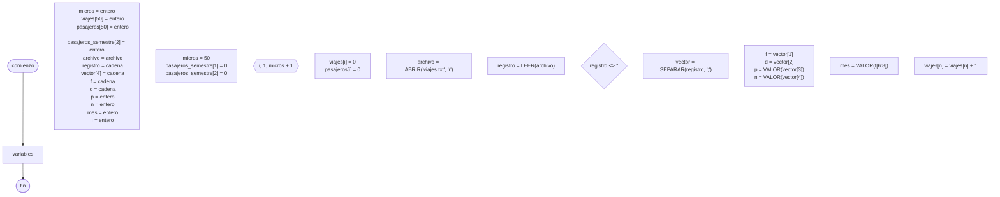

# 20241103 - Micros

Se tiene el siguiente [[Archivo]]  `viajes.txt` plano con los viajes realizados por una empresa de micros de larga distancia durante el año 2023. Cada registro tiene la siguiente estructura, con el separador ";":

- Fecha de viaje (cadena aaaa/mm/aa)
- Destino (cadena)
- Pasajeros (entero)
- Número de micro (entero, entre 1 y 50)

Mostrar:

- Cantidad de viajes realizados por cada número de micro
- Total de pasajeros transportados por cada número de micro
- Total de pasajeros transportados por cada semestre

## Diagrama de flujo



## Código

```embed-python
PATH: "vault://Algoritmos y Estructuras de Datos/python/20241103-micros/main.py"
```

```embed-python
PATH: "vault://Algoritmos y Estructuras de Datos/python/20241103-micros/viajes.txt"
```
