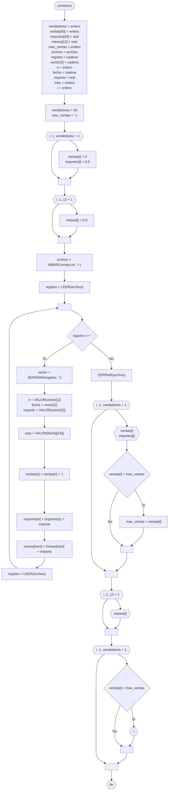

# 20241105 - Concesionario

Existe un [[Archivo]] plano  `ventas.txt` con los datos de las ventas de automóviles efectuadas por vendedores de una empresa en el año 2022, separador ";". Cada registro representa una venta.

- Número de vendedor (entero, entre 1 y 40)
- Fecha de facturación (cadena dd/mm/aaaa)
- Importe (real)

Mostrar:

- Cantidad de ventas realizadas por cada número de vendedor.
- Total de importe facturado por cada número de vendedor.
- Total de importe facturado en cada mes.
- Número de vendedor con la mayor cantidad de ventas realizadas (máximo repetido).

## Diagrama de flujo



## Código

```embed-python
PATH: "vault://Algoritmos y Estructuras de Datos/python/20241105-concesionario/main.py"
```
