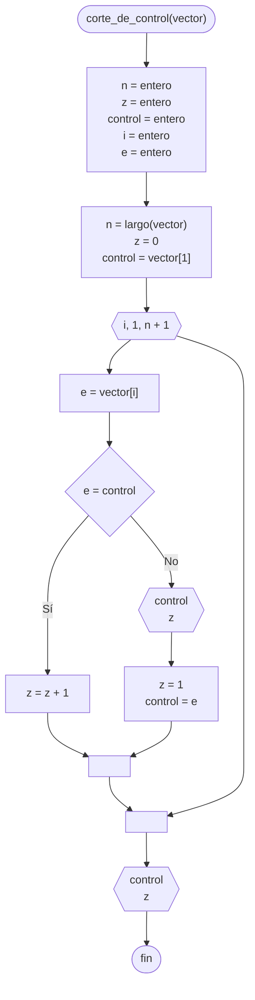

# 20241105 - Corte de control

Se tiene un [[Vector]] del tipo entero de 1000 elementos el cual se encuentra cargado y ordenado. Mostrar la cantidad de veces que se repite cada número.

## Diagrama de flujo



## Código

```embed-python
PATH: "vault://Algoritmos y Estructuras de Datos/python/20241105-corte-de-control.py"
```
