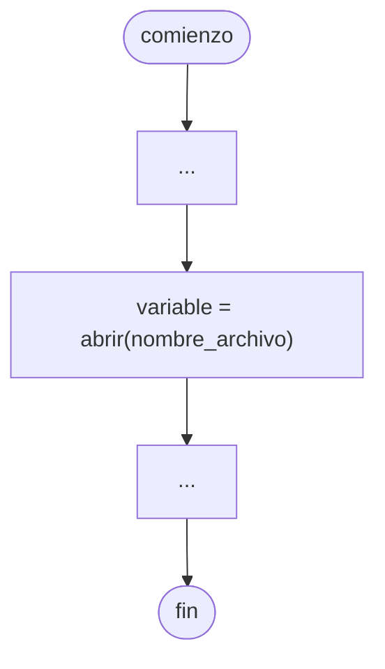

# Archivo

Una [[Estructuras de datos]] que de almacena en memoria **permanente**.

Un [[Archivo]] es un [[Conjunto]] de registros. Un registro es un [[Conjunto]] de campos, y en cada campo guardamos un [[Dato]].

Por ejemplo, la siguiente tabla representa un [[Archivo]].

| Registro 1 | Registro 2 |
| ---------- | ---------- |
| Campo      | Campo      |
| Campo      | Campo      |
| Campo      | Campo      |

> [!tip]
> Todo [[Archivo]] siempre tiene una **marca de final de [[Archivo]]** o EOF: *End Of File*.

## Abrir archivo

En [[Python]], se realiza de la siguiente forma.

```python
nombre = "test.txt"
modo = "w"

archivo = open(nombre, modo)
```

En un [[Diagrama de flujo]], se realiza de la siguiente forma.



Existen múltiples modos para abrir un archivo, algunos de los más utilizados son los siguientes.

### Modo escritura

```python
open(nombre, "w")
```

Escribe el [[Archivo]] desde 0, eliminando sus contenidos previos.

> [!note]
> Si el [[Archivo]] no existe, se crea automáticamente.

### Modo lectura

```python
open(nombre, "r")
```

Nos permite leer los contenidos de un [[Archivo]].

> [!caution]
> El [[Archivo]] debe existir. Caso contrario, devuelve un [[Errores|Error]] de tipo `FileNotFoundError`.

Al abrir el [[Archivo]] en [[Archivo#Modo lectura]], un **puntero** se ubica en el **primer registro**.

### Modo append

```python
open(nombre, "a")
```

Permite escribir [[Información]] al [[Archivo]], sin eliminar sus contenidos previos.

> [!note]
> Si el [[Archivo]] no existe, se crea automáticamente.

## Cerrar archivo

Es importante **cerrar** el [[Archivo]]. Si nos olvidamos de hacerlo, pueden haber *memory leaks*, y es posible que los cambios realizados **no sean guardados**.

En [[Python]], se realiza de la siguiente forma.

```python
archivo.close()
```

En [[Diagrama de flujo]], se realiza de la siguiente forma.


## Escribir archivo
