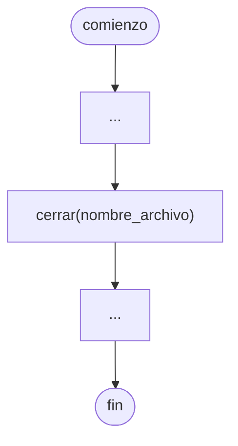
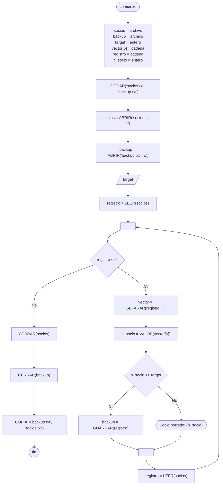

# Archivo

Una [[Estructuras de datos]] que de almacena en memoria **permanente**.

Un [[Archivo]] es un [[Conjunto]] de registros. Un registro es un [[Conjunto]] de campos, y en cada campo guardamos un [[Dato]].

Por ejemplo, la siguiente tabla representa un [[Archivo]].

|                | Campo 1 | Campo 2 |
| -------------- | ------- | ------- |
| **Registro 1** | Valor   | Valor   |
| **Registro 2** | Valor   | Valor   |
| **Registro 3** | Valor   | Valor   |

> [!tip]
> Todo [[Archivo]] siempre tiene una **marca de final de [[Archivo]]** o EOF: *End Of File*. En [[Python]], es una **cadena vacía** (`""`).

## Abrir archivo

En [[Python]], se realiza de la siguiente forma.

```python
nombre = "test.txt"
modo = "w"

archivo = open(nombre, modo)
```

En un [[Diagrama de flujo]], se realiza de la siguiente forma.


Existen múltiples modos para abrir un archivo, algunos de los más utilizados son los siguientes.

### Modo escritura

```python
open(nombre, "w")
```

Escribe el [[Archivo]] desde 0, eliminando sus contenidos previos.

> [!note]
> Si el [[Archivo]] no existe, se crea automáticamente.

### Modo lectura

```python
open(nombre, "r")
```

Nos permite leer los contenidos de un [[Archivo]].

> [!caution]
> El [[Archivo]] debe existir. Caso contrario, devuelve un [[Errores|Error]] de tipo `FileNotFoundError`.

Al abrir el [[Archivo]] en [[Archivo#Modo lectura]], un **puntero** se ubica en el **primer registro**.

### Modo append

```python
open(nombre, "a")
```

Permite escribir [[Información]] al [[Archivo]], sin eliminar sus contenidos previos.

> [!note]
> Si el [[Archivo]] no existe, se crea automáticamente.

## Cerrar archivo

Es importante **cerrar** el [[Archivo]]. Si nos olvidamos de hacerlo, pueden haber *memory leaks*, y es posible que los cambios realizados **no sean guardados**.

En [[Python]], se realiza de la siguiente forma.

```python
archivo.close()
```

En [[Diagrama de flujo]], se realiza de la siguiente forma.



## Leer archivo

Podemos leer un **registro** de un [[Archivo]] utilizando el método `readline`.

> [!important]
> Cada vez que llamamos al método `readline`, nos devuelve una nueva línea.

```python
archivo = open(nombre, "r")

registro = archivo.readline()
print(registro) # linea 1

registro = archivo.readline()
print(registro) # linea 2
```

> [!warning]
> Una vez que se leyeron todas las líneas, el método `readline` devuelve una cadena vacía.

## Escribir archivo

Podemos escribir un **registro** a un [[Archivo]] utilizando el método `write`.

```python
archivo = open(nombre, "w")
registro = f"{campo1};{campo2};{campo3}"

archivo.write(registro + "\n")
archivo.close()
```

> [!tip]
> Para que cada registro esté en una línea nueva, agregamos `\n`.

## Eliminar registro

Para eliminar un **registro** de un [[Archivo]], creamos una copia del mismo, donde reescribimos el [[Archivo]] registro por registro, omitiendo aquel que queremos eliminar. Luego, copiamos los contenidos de este nuevo [[Archivo]], al [[Archivo]] original.

### Diagrama de flujo

En [[Diagrama de flujo]] se realiza de la siguiente forma.



### Python

En [[Python]] se realiza de la siguiente forma. Para crear la copia del [[Archivo]], utilizamos el [[Módulo shutil]].

```python
import shutil

shutil.copy("socios.txt", "backup.txt")

target = int(input("Número de socio a borrar: "))

elem = 5
vector = [""] * elem
socios = open("socios.txt", "r")
backup = open("backup.txt", "w")
registro = socios.readline().strip()
  
while registro != "":
    vector = registro.split(";")
    n_socio = int(vector[0])
  
    if n_socio != target:
        backup.write(registro + "\n")
    else:
        print(f"Socio eliminado: {n_socio}")
  
    registro = socios.readline().strip()
  
socios.close()
backup.close()
  
shutil.copy("backup.txt", "socios.txt")
```
