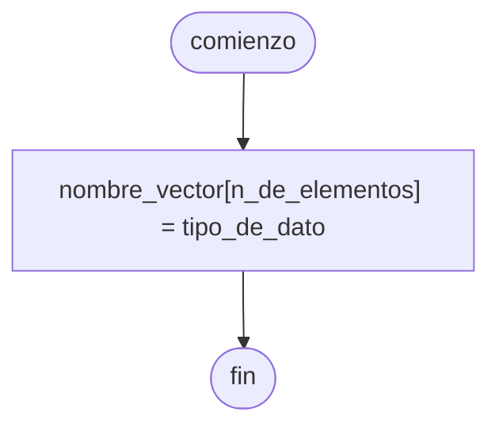

---
aliases:
  - Lista
  - Vector
created: 2024-08-06 21:28:01
modified: 2024-08-06 22:14:39
title: Array
---

# Array

Un ==[[Conjunto]] de elementos==, dentro de los cuales podemos almacenar un [[Dato]].

> [!tip]
> En [[Python]] los elementos de una [[Array|Lista]] pueden ser de ==cualquier tipo de dato==, pero esto no es posible en cualquier [[Lenguaje de programación]]

En [[Python]], podemos hacerlo de la siguiente forma.

```python
array = [2, "abc", True, 0.5]
```

Para trabajar con un elemento de un [[Array]], debemos seleccionarlo por su ==índice==.

> [!warning]
> El índice de los elementos de un [[Array]] suele comenzar en $0$, no en $1$.

En [[Python]], podemos hacerlo de la siguiente forma.

```python
array = [3, 5]
array[0] += 4

print(array[0]) # 7
print(array[1]) # 5
```

## Array multidimensional

Un [[Array]] ==multidimensional==, es un [[Array]] cuyos ==elementos son [[Array|Arrays]] o [[Array|Vectores]]==. Por lo tanto, también podemos considerarlas [[Matriz|Matrices]]. Por ejemplo, en [[Python]], una [[Matriz]] bidimensional de $3 \times 3$:

```python
matriz = [[1, 2, 3],
		  [4, 5, 6],
		  [7, 8, 9]]
```

O una [[Matriz]] tridimensional de $2 \times 2 \times 2$:

```python
matriz = [[[1, 2], [3, 4]],
		  [[5, 6], [7, 8]]]
```

## Diagrama de flujo



## Python

```python
nombre_vector = [valor_inicial] * elementos

# ejemplo
elementos = 3
vector_r3 = [0.0] * elementos # [0.0, 0.0, 0.0]
```
