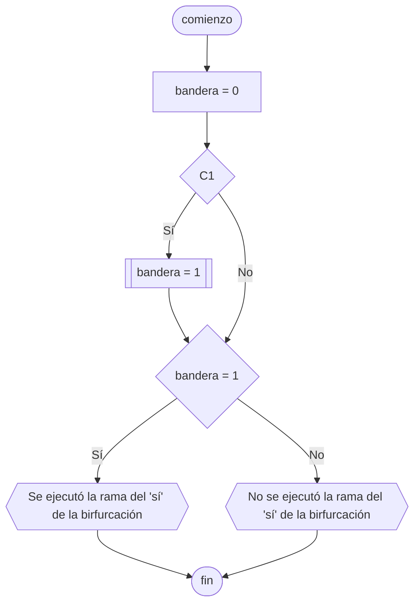

---
aliases:
  - Señal
created: 2024-05-07 21:08:58
modified: 2024-05-08 01:33:30
title: Bandera
---

# Bandera

Se utiliza para saber si la ejecución de un [[Programa propio]] pasó por un cierto punto del código o no. Es decir, es una [[Variables|variable]] que puede ser verdadera o falsa.

Por ejemplo, podemos utilizarla para saber si una de las ramas de una [[Bifurcaciones|bifurcación]] fue ejecutada o no.

