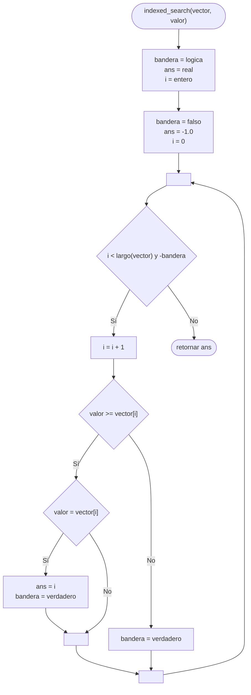

---
aliases:
  - Búsqueda dicotómica
created: 2024-09-03 22:31:58
modified: 2024-09-17 20:17:27
title: Búsqueda binaria
---

# Búsqueda binaria

Dado un [[Array|Vector]] [[Ordenamiento|Ordenado]], este [[Algoritmos|Algoritmo]] analiza el valor del elemento en el **punto medio** del [[Array|Vector]]; si el número es mayor al valor buscado, sabemos que el valor a encontrar puede estar en la **primera mitad** del [[Array|Vector]]; caso contrario, puede estar en la **segunda mitad**. Si al realizar esta [[Búsqueda]] se determina que el valor buscado **no existe**, se retornará $-1$.

> [!tip]
> El beneficio de este tipo de [[Búsqueda]] es que es capaz de generar una [[Salidas|Salida]] realizando en promedio $\log n$ operaciones, que es menor a otros tipos de [[Búsqueda]].

> [!important]
> El [[Array|Vector]] en cuestión debe estar [[Ordenamiento|Ordenado]].

## Diagrama de flujo

El [[Diagrama de flujo]] se realiza de la siguiente forma.



## Python

En [[Python]] se realiza de la siguiente forma.

```python
def indexed_search(vector, valor):
    bandera = False
    ans = -1.0
    i = 0
    
    while i < len(vector) and not bandera:
        i += 1
        
        if valor >= vector[i]:
            if valor == vector[i]:
                ans = i
                bandera = True
        else:
            bandera = True
    
    return ans
```
