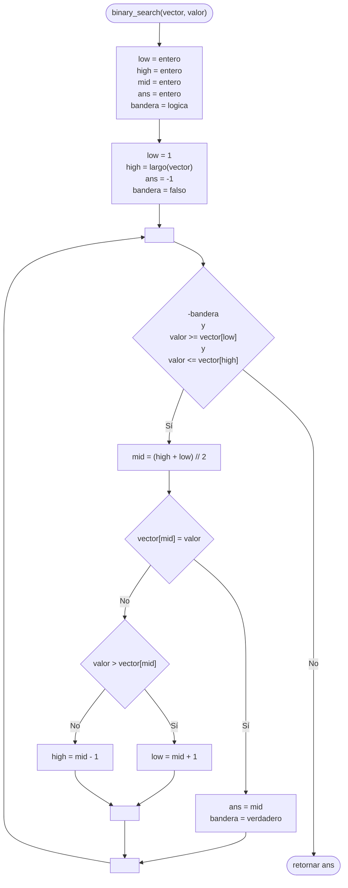

---
aliases:
  - Búsqueda dicotómica
created: 2024-09-03 22:31:58
modified: 2024-09-17 22:16:14
title: Búsqueda binaria
---

# Búsqueda binaria

Dado un [[Vector|Vector]] [[Algoritmos y Estructuras de Datos/Ordenamiento|Ordenado]], este [[Algoritmos|Algoritmo]] divide al [[Vector|Vector]] en dos subvectores de igual tamaño tantas veces como sea necesario.

> [!important]
> Al elemento que separará a las dos mitades del [[Vector|Vector]], lo llamaremos **elemento central**.
> 
> Podemos obtenerlo utilizando la **división entera**.
>
> ``` python
> central = len(vector) // 2
> ```

Si el valor buscado **no existe** en ninguna de las dos mitades, retornamos $-1$. Si está en alguna de las mitades, **volvemos a realizar el mismo proceso**, hasta llegar a un único elemento, que puede o no ser el valor buscado.

> [!tip]
> El beneficio de este tipo de [[Búsqueda]] es que es capaz de generar una [[Salidas|Salida]] realizando un máximo de $\log n$ barridos, menor a otros tipos de [[Búsqueda]].

> [!important]
> El [[Vector|Vector]] en cuestión debe estar [[Algoritmos y Estructuras de Datos/Ordenamiento|Ordenado]].

## Diagrama de flujo

El [[Diagrama de flujo]] se realiza de la siguiente forma.



## Python

En [[Python]] se realiza de la siguiente forma.

```python
def binary_search(vector, valor):
    low = 0
    high = len(vector) - 1
    ans = -1
    bandera = False
    
    while not bandera and valor >= vector[low] and valor <= vector[high]:
        mid = (high + low) // 2
        
        if vector[mid] == valor:
            ans = mid
            bandera = True
        elif valor > vector[mid]:
            low = mid + 1
        else:
            high = mid - 1
    
    return ans
```
