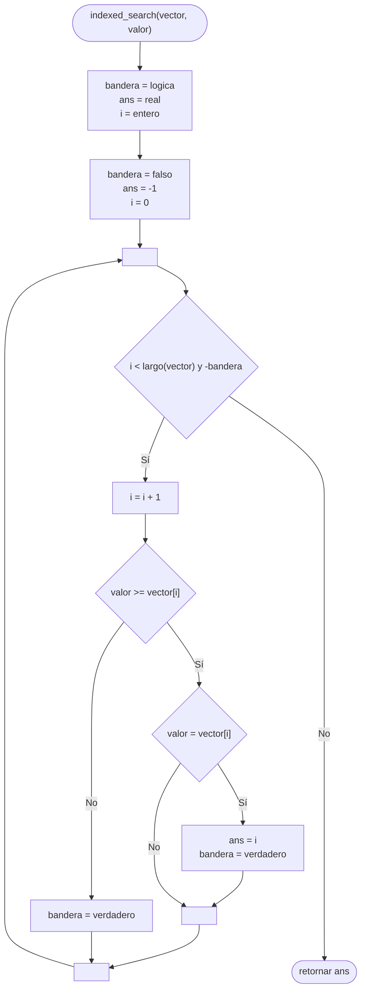

# Búsqueda indexada

Dado un [[Vector|Vector]] [[Ordenamiento|Ordenado]], este [[Algoritmos|Algoritmo]] compara elemento por elemento hasta encontrar el valor buscado; o hasta que los valores evaluados sean **mayores al valor buscado**, lo que significa que el valor buscado **no existe** y se retornará $-1$.

> [!tip]
> El beneficio de este tipo de [[Búsqueda]] es que en la mayoría de casos, si el valor buscado no existe, es capaz de finalizar la [[Búsqueda]] sin necesidad de recorrer todo el vector.

> [!important]
> El [[Vector|Vector]] en cuestión debe estar [[Ordenamiento|Ordenado]].

## Diagrama de flujo

El [[Diagrama de flujo]] se realiza de la siguiente forma.



## Python

En [[Python]] se realiza de la siguiente forma.

```python
def indexed_search(vector, valor):
    bandera = False
    ans = -1
    i = 0
    
    while i < len(vector) and not bandera:
        i += 1
        
        if valor >= vector[i]:
            if valor == vector[i]:
                ans = i
                bandera = True
        else:
            bandera = True
    
    return ans
```
