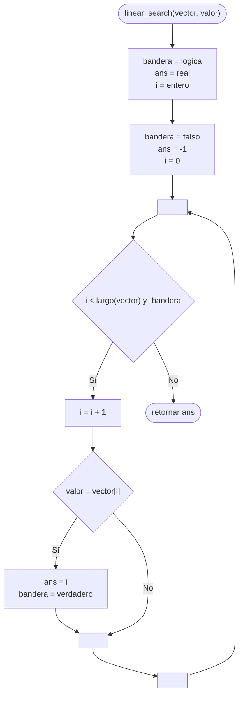

---
aliases:
  - Búsqueda lineal
created: 2024-09-03 22:47:38
modified: 2024-09-17 21:32:00
title: Búsqueda secuencial
---

# Búsqueda secuencial

Este [[Algoritmos|Algoritmo]] compara elemento por elemento hasta encontrar el valor buscado. Si el valor no existe, realizará un barrido de todo el [[Array|Vector]] y retornará $-1$.

> [!tip]
> El beneficio de este tipo de [[Búsqueda]] es que no necesitamos que el [[Array|Vector]] esté [[Ordenamiento|Ordenado]].

## Diagrama de flujo

El [[Diagrama de flujo]] se realiza de la siguiente forma.



## Python

En [[Python]] se realiza de la siguiente forma.

```python
def linear_search(vector, valor):
    bandera = False
    ans = -1
    i = 0
    
    while i < len(vector) and not bandera:
        i += 1
        
        if valor == vector[i]:
            ans = i
            bandera = True
    
    return ans
```
