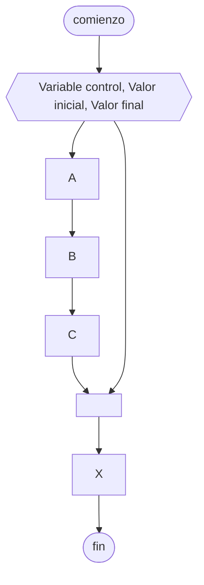

# Ciclo desde-hasta

Es una [[Estructura de repetición]] que ejecuta una serie de instrucciones dadas un ==número fijo de veces==.

Para esto, utilizamos una [[Variables|Variable]] de control, y le especificamos cuál debe ser su valor inicial y final.

## Diagrama de flujo



## Python

```python
# Este ciclo se ejecutará 10 veces
for i in range(0, 10): # El intervalo es de la forma [0, 10)
    print(f"El ciclo se ejecutó {i} veces")
```
