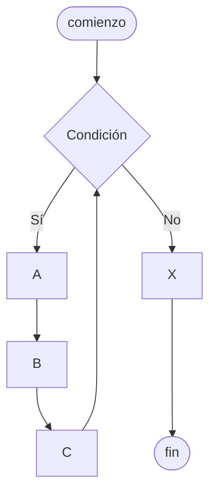

# Ciclo mientras

Es una [[Estructura de repetición]] que ejecuta una serie de instrucciones dadas **mientras** se cumpla una condición.

Para evitar que se vuelva un ciclo infinito, podemos utilizar diferentes estrategias:

- Utilizar un [[Contador]]
- Controlar con una opción a continuar
- Controlar con [[Valor centinela]]
- Controlar con una [[Bandera]]

## Pseudocódigo

```
c = 0

mientras c < 4 entonces
    c = c + 1
    mostrar("El ciclo se ejecutó {c} veces")
fin_mientras
```

## Diagrama de flujo



## Python

```python
c = 0

while c < 4:
    c = c + 1
    print(f"El ciclo se ejecutó {c} veces")
```
