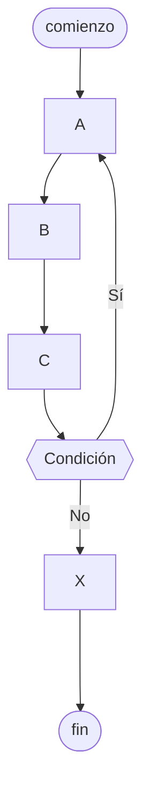

# Ciclo repetir-hasta

Es una [[Estructura de repetición]] que ejecuta una serie de instrucciones dadas, y solo continúa ejecutándose **mientras** se cumpla una condición, que solo se evalúa luego de la primera iteración del bucle. También conocida como `do while`.

[[Python]] no tiene una estructura nativa para el ciclo repetir-hasta.

## Pseudocódigo

```
c = 0

repetir
    c = c + 1
    mostrar("El ciclo se ejecutó {c} veces")
hasta c < 4
```

## Diagrama de flujo


