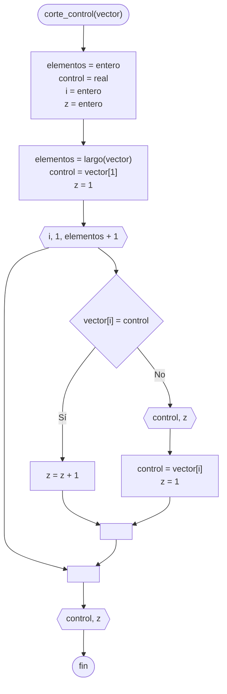

---
aliases:
  - Control por ruptura
created: 2024-09-03 21:06:59
modified: 2024-09-09 03:57:08
title: Corte de control
---

# Corte de control

Determinar la cantidad de veces que se repite un [[Dato]] en un [[Vector|Vector]].

```python
vector = [5, 10, 5, 15, 5]
```

Para esto realizamos un [[Ordenamiento]] del [[Vector|Vector]].

```python
vector = [5, 5, 5, 10, 15]
```

Luego, utilizando un [[Estructura de repetición|Bucle]], aumentamos un [[Contador]] cada vez que se repite la [[Variables|Variable]] de **control**. Una vez que ya no se repite, estamos ante un **corte de control**, y debemos mostrar la cantidad de veces $z$ que se repite un número $x$.

## Diagrama de flujo

El [[Diagrama de flujo]] se realiza de la siguiente forma.



## Python

En [[Python]] se realiza de la siguiente forma.

```python
def corte_control(vector):
    elementos = len(vector)
    control = vector[0]
    z = 0
    
    for i in range(0, elementos):
        if vector[i] == control:
            z += 1
        else:
            print(f"{control} está {z} veces")
            control = vector[i]
            z = 1
    
    print(f"{control} está {z} veces")
```
