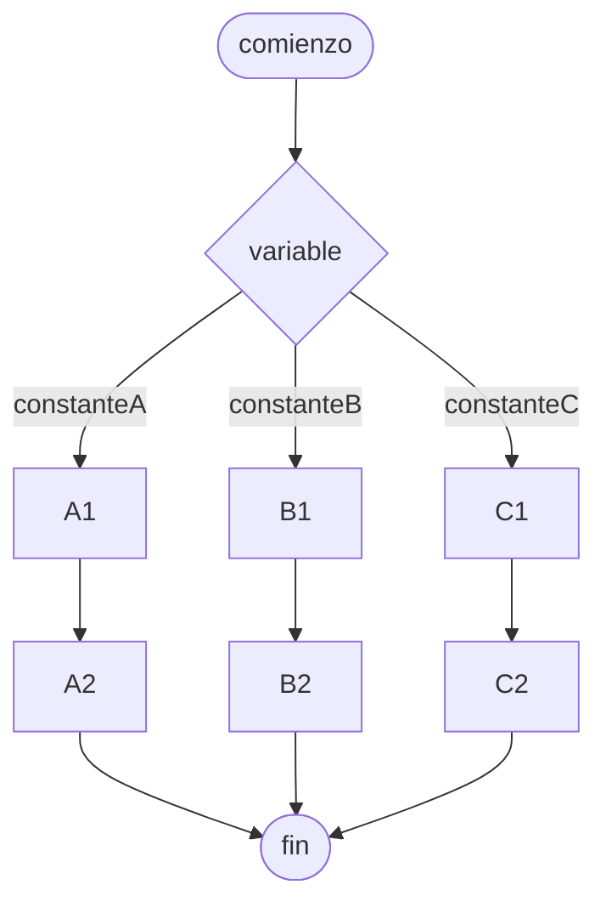

# Estructura de casos

Un tipo de [[Estructuras de control#De selección]] que ejecuta un 

Se puede representar con [[Pseudocódigo]] o [[Diagrama de flujo]]. Python implementó está estructura en la versión 3.10, pero también se puede hacer algo similar utilizando [[Bifurcaciones]] anidadas con `elif`.

## Diagrama de flujo

## Pseudocódigo

![[Pseudocódigo#^estructura-de-casos]]
