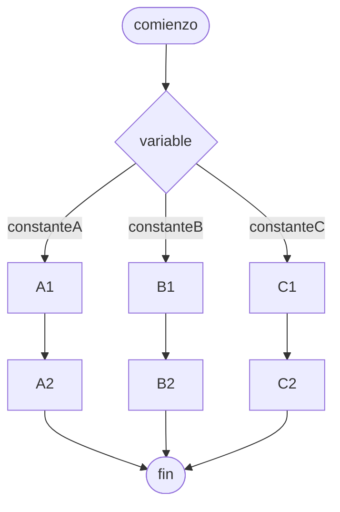

# Estructura de casos

Un tipo de [[Estructuras de control#De selección]] que ejecuta un 

Se puede representar con [[Pseudocódigo]] o [[Diagrama de flujo]], pero Python no cuenta con esta estructura.

## Diagrama de flujo



## Pseudocódigo

```
comienzo

segun_sea variable hacer
    constanteA:
        A1
        A2
    constanteB:
        B1
        B2
    constanteC:
        C1
        C2
fin_

fin
```
