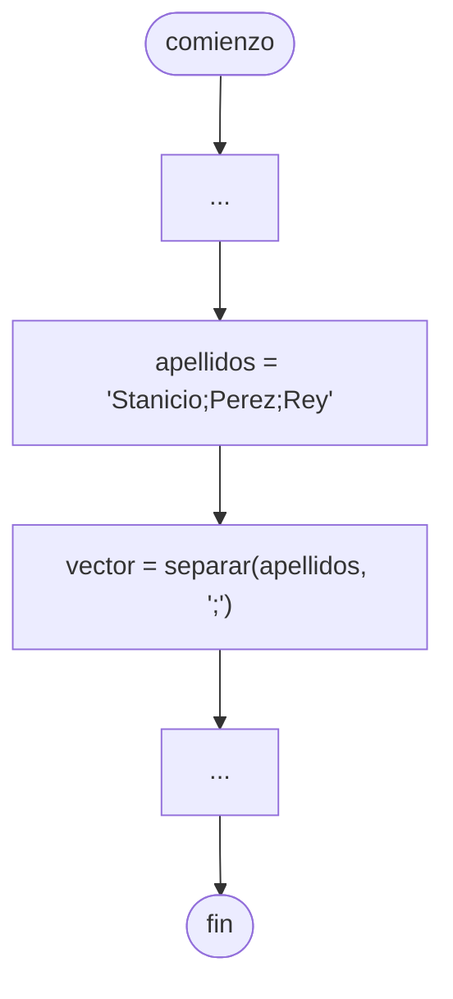

# Función split

En [[Python]], la [[Algoritmos y Estructuras de Datos/Función|Función]] `split` nos permite crear un [[Vector]] a partir de una [[Variables|Variable]] de tipo **cadena**, especificando el **separador** utilizado.

```python
vector = variable.split(separador)
```

Por ejemplo, con una [[Vector|Lista]] de apellidos.

```python
apellidos = "Stanicio;Perez;Rey"
vector = apellidos.split(";") # ["Stanicio", "Perez", "Rey"]
```

## Diagrama de flujo

En un [[Diagrama de flujo]], se realiza de la siguiente forma.


