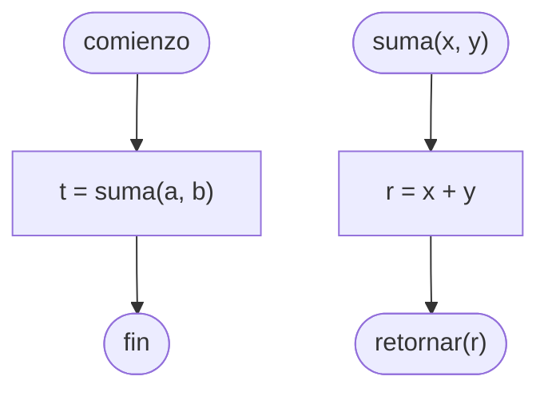

# Función

Un bloque de código que puede recibir [[Parámetros]] de [[Entradas|Entrada]], ejecuta las instrucciones dadas, y ==devuelve un único valor== de [[Salidas|Salida]].

## Python

En [[Python]], las funciones se declaran de la siguiente forma.

```python
def suma(x, y):
    r = x + y
    
    return r

t = suma(a, b)
```

> [!tip]
> Para indicar la [[Salidas|Salida]] de un [[Algoritmos y Estructuras de Datos/Función|Función]] en [[Python]], utilizamos la palabra `return`.

## Diagrama de flujo

En un [[Diagrama de flujo]], las funciones se declaran de la siguiente forma.


