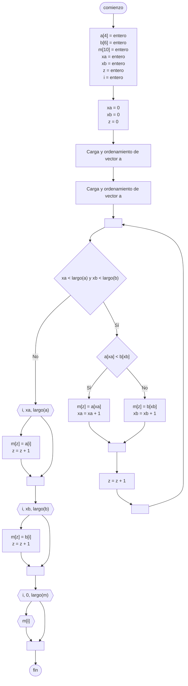

---
aliases:
  - Vector merge
created: 2024-10-08 21:11:00
modified: 2024-10-09 00:43:40
title: Mezcla de vectores
---

# Mezcla de vectores

Dados 2 [[Vector|Vectores]] **ordenados** obtener un tercer [[Vector]] [[Ordenamiento|Ordenado]].

## Diagrama de flujo

En [[Diagrama de flujo]], se realiza de la siguiente forma.



## Python

En [[Python]], se realiza de la siguiente forma.

```Python
from random import randint

a = [0] * 4
b = [0] * 6
m = [0] * 10

xa = 0
xb = 0
z = 0

for i in range(0, len(a)):
    a[i] = randint(0, 100)

for i in range(0, len(b)):
    b[i] = randint(0, 100)

a.sort()
b.sort()

while xa < len(a) and xb < len(b):
    if a[xa] < b[xb]:
        m[z] = a[xa]
        xa += 1
    else:
        m[z] = b[xb]
        xb += 1
    
    z += 1

for i in range(xa, len(a)):
    m[z] = a[i]
    z += 1

for i in range(xb, len(b)):
    m[z] = b[i]
    z += 1

for i in range(0, len(m)):
    print(m[i])
```
