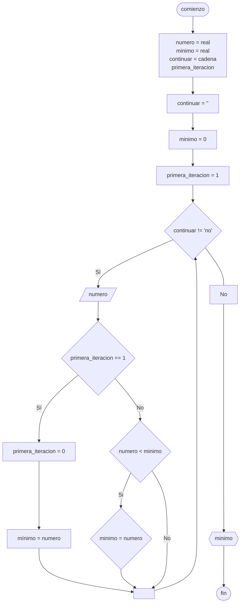

# Mínimo

El [[Algoritmos|algoritmo]] para encontrar el mínimo de una lista de números.

## Diagrama de flujo

```mermaid
flowchart TB
	comienzo([comienzo])
    
	variables["`numero = real
	minimo = real
	continuar = cadena
	primera_iteracion`"]
    
    continuar["continuar = ''"]
    minimo["minimo = 0"]
    primera_iteracion["primera_iteracion = 1"]
    
    mientras{"continuar != 'no'"}
    
    leer_numero[/numero/]
    
        condicion{"primera_iteracion == 1"}
            primera_iteracion_desactivar["primera_iteracion = 0"]
            minimo_primera_iteracion["mínimo = numero"]
            
            comparacion{"numero < minimo"}
            comparacion_si{"minimo = numero"}
    
	a[" "]
	
	mostrar{{minimo}}
	
	fin([fin])
    
	comienzo --> variables --> continuar --> minimo --> primera_iteracion --> mientras
	mientras -- Sí --> leer_numero --> condicion
	condicion -- Sí --> primera_iteracion_desactivar --> minimo_primera_iteracion --> a
	condicion -- No --> comparacion
	comparacion -- Si --> comparacion_si --> a
	comparacion -- No --> a
	a --> mientras
	mientras --- No ----> mostrar --> fin
```
