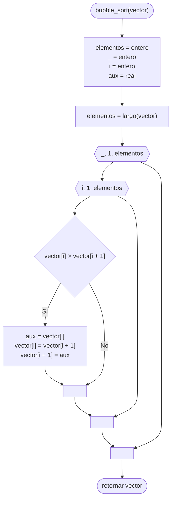

---
aliases:
  - Bubble sort
created: 2024-08-27 21:14:45
modified: 2024-09-09 02:58:22
title: Ordenamiento burbuja
---

# Ordenamiento burbuja

Dado un [[Vector|Vector]] de $n$ elementos, para realizar el [[Ordenamiento]], deberemos realizar $n - 1$ *barridos*.

## Diagrama de flujo

El [[Diagrama de flujo]] se realiza de la siguiente forma.



## Python

En [[Python]] se realiza de la siguiente forma.

```python
def bubble_sort(vector):
    elementos = len(vector)
    
    for _ in range(0, elementos - 1):
        for i in range(0, elementos - 1):
            if vector[i] > vector[i + 1]:
                aux = vector[i]
                vector[i] = vector[i + 1]
                vector[i + 1] = aux
                
    return vector
```
