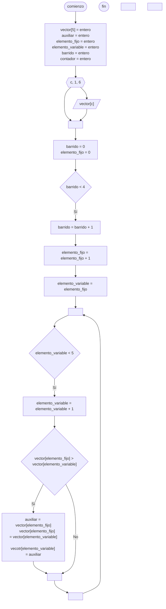

---
aliases:
  - Insertion sort
created: 2024-08-27 21:14:45
modified: 2024-08-27 22:01:29
title: Ordenamiento por inserción
---

# Ordenamiento por inserción

Dado un [[Array|Vector]] de $n$ elementos, para realizar el [[Ordenamiento]], deberemos realizar $n - 1$ *barridos*.

## Concepto

Por ejemplo, con el siguiente [[Array|Vector]].

```python
vector = [10, 5, 30, 7, 15]
```

### Barrido 1

Aquí nuestro elemento fijo será $10$, y nuestro elemento variable será $5$.

```python
vector[fijo] > vector[variable] # True
```

Por lo tanto, intercambiamos los elementos, de la siguiente forma.

```python
vector = [5, 10, 30, 7, 15]
```

Ahora nuestro elemento fijo será $5$, y nuestro elemento variable será $30$.

```python
vector[fijo] > vector[variable] # False
```

Por lo tanto, no modificamos el orden.

```python
vector = [5, 10, 30, 7, 15]
```

Ahora nuestro elemento fijo será $5$, y nuestro elemento variable será $7$.

```python
vector[fijo] > vector[variable] # False
```

Por lo tanto, no modificamos el orden.

```python
vector = [5, 10, 30, 7, 15]
```

Ahora nuestro elemento fijo será $5$, y nuestro elemento variable será $15$.

```python
vector[fijo] > vector[variable] # False
```

Por lo tanto, no modificamos el orden.

```python
vector = [5, 10, 30, 7, 15]
```

### Barrido 2

Aquí nuestro elemento fijo será $10$, y nuestro elemento variable será $30$.

> [!note]
> Los elementos anteriores al elemento fijo sabemos que ya están ordenados.

```python
vector[fijo] > vector[variable] # False
```

Por lo tanto, no modificamos el orden.

```python
vector = [5, 10, 30, 7, 15]
```

Ahora nuestro elemento fijo será $10$, y nuestro elemento variable será $7$.

```python
vector[fijo] > vector[variable] # True
```

Por lo tanto, intercambiamos los elementos, de la siguiente forma.

```python
vector = [5, 7, 30, 10, 15]
```

Ahora nuestro elemento fijo será $7$, y nuestro elemento variable será $15$.

```python
vector[fijo] > vector[variable] # False
```

Por lo tanto, no modificamos el orden.

```python
vector = [5, 7, 30, 10, 15]
```

### Barrido 3

Aquí nuestro elemento fijo será $30$, y nuestro elemento variable será $10$.

```python
vector[fijo] > vector[variable] # True
```

Por lo tanto, intercambiamos los elementos, de la siguiente forma.

```python
vector = [5, 7, 10, 30, 15]
```

Ahora nuestro elemento fijo será $10$, y nuestro elemento variable será $15$.

```python
vector[fijo] > vector[variable] # False
```

Por lo tanto, no modificamos el orden.

```python
vector = [5, 7, 10, 30, 15]
```

### Barrido 4

Aquí nuestro elemento fijo será $30$, y nuestro elemento variable será $15$.

```python
vector[fijo] > vector[variable] # True
```

Por lo tanto, intercambiamos los elementos, de la siguiente forma.

```python
vector = [5, 7, 10, 15, 30]
```

## Diagrama de flujo

El [[Diagrama de flujo]] se realiza de la siguiente forma.


