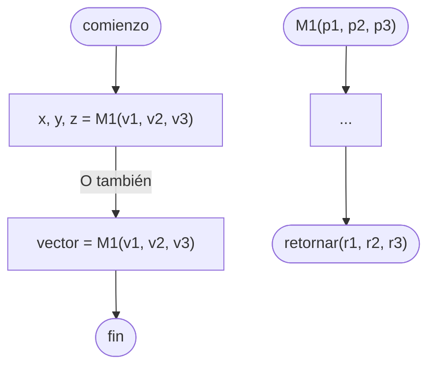

# Procedimiento

Un [[Conjunto]] de sentencias que recibe **parámetros** de [[Entradas|Entrada]], ejecuta las instrucciones dadas, y, a diferencia de una [[Análisis Matemático I/Función|Función]], puede tener una ==única [[Salidas|Salida]], múltiples, o ninguna==.

> [!tip]
> La [[Salidas|Salida]] de un [[Procedimiento]] puede guardarse en [[Variables]] individuales, o en una [[Vector|Lista]].

## Python

En [[Python]], los procedimientos se declaran y se utilizan de la siguente forma.

```python
def procedimiento(p1, p2, p3)
    ...
    return r1, r2, r3

x, y, z = procedimiento(v1, v2, v3)
# o también
vector = procedimiento(v1, v2, v3)
```

## Diagrama de flujo

En un [[Diagrama de flujo]], los procedimientos se declaran y se utilizan de la siguente forma.


