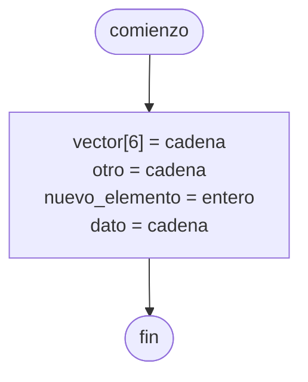

# Vector circular

Permite reutilizar los elementos de un [[Vector]], de forma que luego de haber utilizado el último elemento, podamos volver a utilizar el primer elemento, y todos los que le siguen.

Para obtener el elemento con el que queremos trabajar, debemos realizar la siguiente operación

```
elemento = (i + 1) RESTO n
```

Donde `i` es el número de elemento, y `n` es la cantidad de elementos en el [[Vector]].

## Diagrama de flujo

El [[Diagrama de flujo]] se realiza de la siguiente forma.


