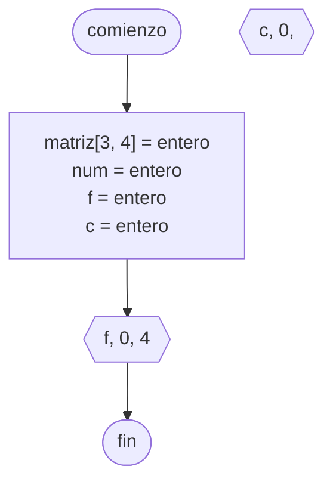

---
aliases:
  - Matriz
created: 2024-09-17 22:29:06
modified: 2024-09-17 22:36:29
title: Vector multidimensional
---

# Vector multidimensional

Un [[Vector]] ==multidimensional==, es un ==[[Vector]] de [[Vector|Vectores]]==. Por lo tanto, también podemos considerarlas [[Matriz|Matrices]]. Por ejemplo, en [[Python]], una [[Matriz]] bidimensional de $3 \times 3$:

```python
matriz = [[1, 2, 3],
		  [4, 5, 6],
		  [7, 8, 9]]
```

O una [[Matriz]] tridimensional de $2 \times 2 \times 2$:

```python
matriz = [[[1, 2], [3, 4]],
		  [[5, 6], [7, 8]]]
```

## Diagrama de flujo

El [[Diagrama de flujo]] se realiza de la siguiente forma.


## Python

En [[Python]] se realiza de la siguiente forma.

```python
nombre_matriz = [valor_inicial] * elementos
```

## Asignación de [[Dato|Datos]]


