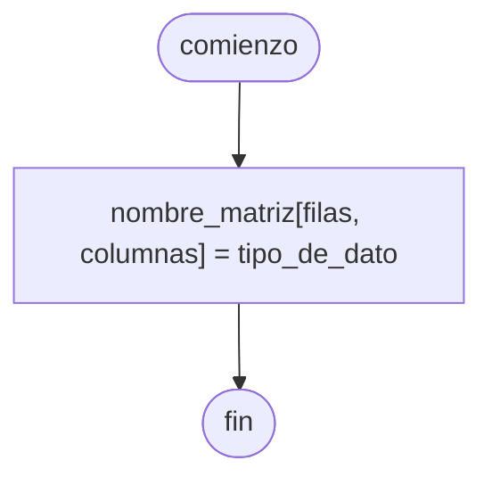
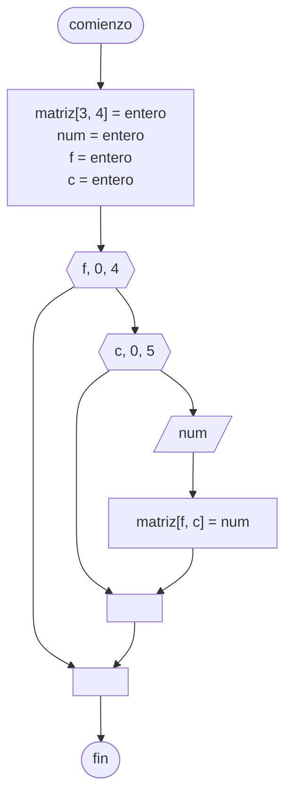

---
aliases:
  - Matriz
created: 2024-09-17 22:29:06
modified: 2024-09-26 14:05:21
title: Vector multidimensional
---

# Vector multidimensional

Un [[Vector]] ==multidimensional==, es un ==[[Vector]] de [[Vector|Vectores]]==. Por lo tanto, también podemos considerarlas [[Matriz|Matrices]]. Por ejemplo, en [[Python]], una [[Matriz]] bidimensional de $3 \times 3$:

```python
matriz = [
    [1, 2, 3],
    [4, 5, 6],
    [7, 8, 9],
]
```

O una [[Matriz]] tridimensional de $2 \times 2 \times 2$:

```python
matriz = [
    [[1, 2], [3, 4],],
    [[5, 6], [7, 8],],
]
```

## Diagrama de flujo

El [[Diagrama de flujo]] se realiza de la siguiente forma.



## Python

En [[Python]] se realiza de la siguiente forma.

```python
nombre_matriz = [
    [0, 0, 0],
    [0, 0, 0],
    [0, 0, 0],
]
```

## Asignación de [[Dato|Datos]]

Realizaremos la carga de los datos **por fila**.

> [!tip]
> Si se quisiera hacer una **carga por columna**, solo hay que intercambiar los [[Estructura de repetición|Ciclos]].

### Diagrama de flujo

El [[Diagrama de flujo]] se realiza de la siguiente forma.



### Python

En [[Python]] se realiza de la siguiente forma.

```python
matriz = [
    [0, 0, 0, 0],
    [0, 0, 0, 0],
    [0, 0, 0, 0],
]
filas = len(matriz) # 3
columnas = len(matriz[0]) # 4

for f in range(0, filas):
    for c in range(0, columnas):
        num = int(input("Número: "))
        matriz[f][c] = num
```
