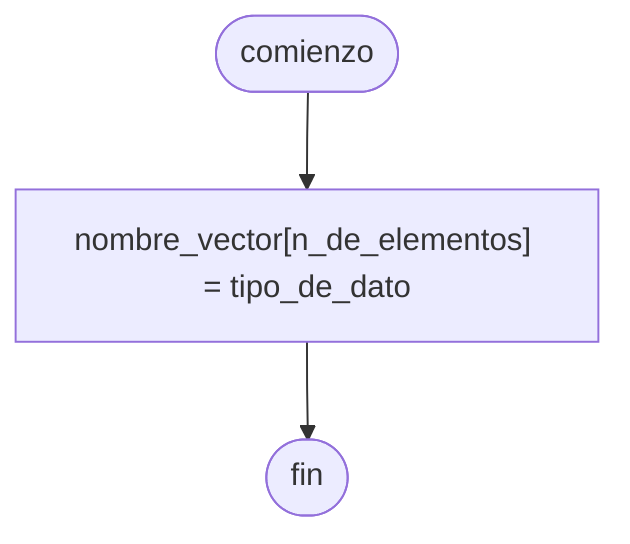

---
aliases:
  - Lista
  - Array
created: 2024-08-06 21:28:01
modified: 2024-09-17 22:31:29
title: Vector
---

# Vector

Un ==[[Conjunto]] de elementos==, dentro de los cuales podemos almacenar un [[Dato]].

> [!tip]
> En [[Python]] los elementos de una [[Array|Lista]] pueden ser de ==cualquier tipo de dato==, pero esto no es posible en cualquier [[Lenguaje de programación]]

En [[Python]], podemos hacerlo de la siguiente forma.

```python
vector = [2, "abc", True, 0.5]
```

Para trabajar con un elemento de un [[Vector]], debemos seleccionarlo por su ==índice==.

> [!warning]
> El índice de los elementos de un [[Vector]] suele comenzar en $0$, no en $1$.

En [[Python]], podemos hacerlo de la siguiente forma.

```python
vector = [3, 5]
vector[0] += 4

print(vector[0]) # 7
print(vector[1]) # 5
```

## Diagrama de flujo

El [[Diagrama de flujo]] se realiza de la siguiente forma.



## Python

En [[Python]] se realiza de la siguiente forma.

```python
nombre_vector = [valor_inicial] * elementos

# ejemplo
elementos = 3
vector_r3 = [0.0] * elementos # [0.0, 0.0, 0.0]
```
