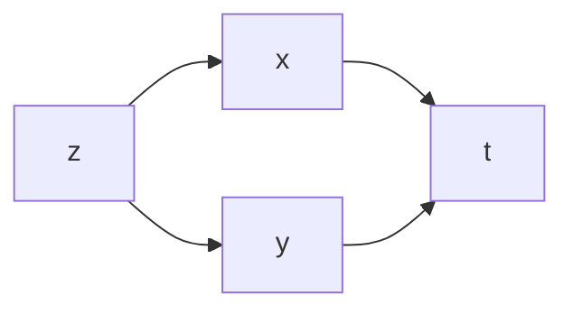

---
aliases:
  - Derivadas de funciones compuestas
created: 2025-05-20 17:48:14
modified: 2025-05-20 17:58:13
title: Derivada de función compuesta
---

# Derivada de función compuesta

Existe un algoritmo que nos permite calcular la [[Derivada]], o [[Derivada parcial|Derivadas parciales]], de una [[Función compuesta]], y particularmente una [[Función real de variable vectorial]].

> [!important]
> Para utilizar este algoritmo es necesario seguir el [[Diagrama funcional]].

1. La [[Derivada]] de una variable respecto de otra es la suma de tantos términos como caminos diferentes, en la dirección de las flechas, conducen de la primera variable a la segunda
2. Cada término representa un camino, y es el producto de tantos factores como flechas tiene ese camino.
3. Cada flecha representa un factor, que es igual a la [[Derivada]] de la variable que está en su origen, respecto de la variable que está en su extremo.

> [!note]
> Al momento de derivar, si tenemos una dependencia simple (una sola variable), calculamos la [[Derivada]] simple; si tenemos una dependencia múltiple (dos o más variables), calculamos la [[Derivada parcial]].

---

Por ejemplo, dada la siguiente [[Análisis Matemático I/Función|Función]].

$$
z = f \left( x(t), y(t) \right)
$$

Sabemos que su [[Diagrama funcional]] es el siguiente.

Por lo tanto, su [[Derivada]] será:

$$
\frac{\partial z}{\partial t} =
\frac{\partial z}{\partial x} \cdot \frac{dx}{dt} + \frac{\partial z}{\partial y} \cdot \frac{dy}{dt}
$$
