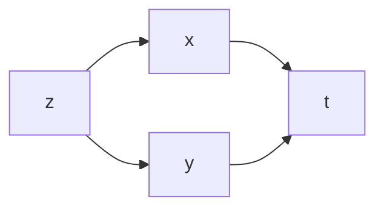
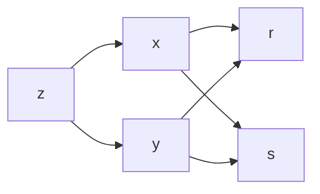

# Diagrama funcional

Es un diagrama que ayuda a mostrar la dependencia de variables en [[Función compuesta|Funciones compuestas]].

---

$$
z = f \left( x(t), y(t) \right)
$$

---

$$
z = f \left( x(r, s), y(r, s) \right)
$$

