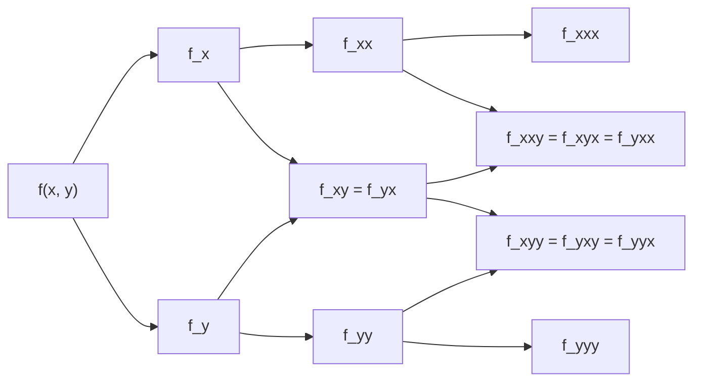

---
aliases:
  - Teorema de Clairaut
created: 2025-05-20 14:45:30
modified: 2025-05-20 15:03:42
title: Teorema de Schwarz
---

# Teorema de Schwarz

Si las [[Derivada parcial|Derivadas parciales]] cruzadas o mixtas $f_{xy}$ y $f_{yx}$ son [[Continuidad|Continuas]] en un [[Conjunto abierto]] $S$, entonces ==son iguales== en cada punto de $S$.

