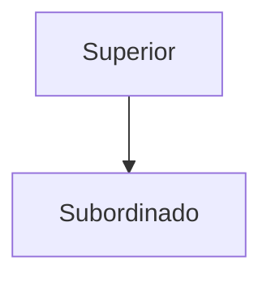

---
aliases:
  - Autoridad lineal
created: 2025-05-01 18:32:29
modified: 2025-05-01 19:11:21
title: Autoridad de línea
---

# Autoridad de línea

Un tipo de [[Autoridad]] en la que un superior ejerce ==supervisión directa== sobre su subordinado.

Favorece el control, y brinda una línea de [[Autoridad]] clara; pero también lleva a una [[Estructura organizacional]] rígida, y ==no favorece a la formación de líderes==.
