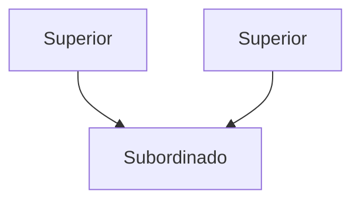

# Autoridad funcional

Un tipo de [[Autoridad]], dada por la tipificación de funciones. Una persona puede responder a jefes de distintos [[Departamentalización|Departamentos]].

Permite un mejor aprovechamiento de la especialización, lo que también permite la reducción de costos gracias a esta ==mayor eficiencia==. Sin embargo, introduce una ==[[Estructura organizacional]] más compleja==, y puede llevar a conflictos y ==problemas de comunicación== por tener que responder a múltiples jefes.
