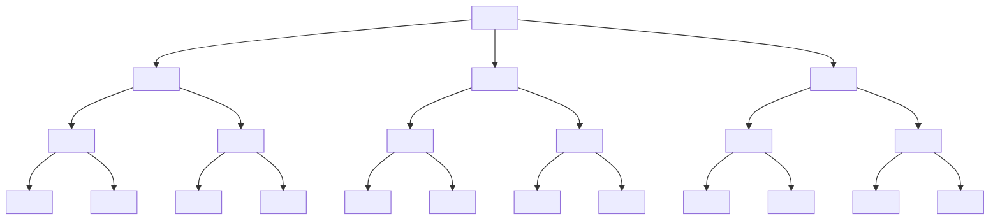
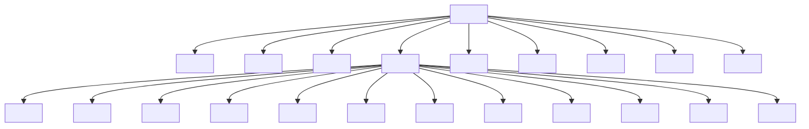

---
aliases:
  - Estructura
created: 2025-05-01 19:10:46
modified: 2025-05-01 19:26:14
title: Estructura organizacional
---

# Estructura organizacional

La [[Estructura]] de una [[Organización]].

## Tramos estrechos

Este formato permite una supervisión estrecha, ==control estricto==, y comunicación rápida.

Sin embargo, se puede ver a simple vista que genera ==muchos niveles administrativos==, y hace que los superiores tiendan a ==involucrarse demasiado== en el trabajo de sus subordinados.

## Tramos amplios

Este formato permite el fácil uso de la ==delegación==, y la creación de políticas claras para toda la [[Organización]].

Sin embargo, genera ==cuellos de botella== en la [[Delegación de decisiones|Toma de decisiones]], haciendo que el superior correspondiente pueda ==perder el control==.
