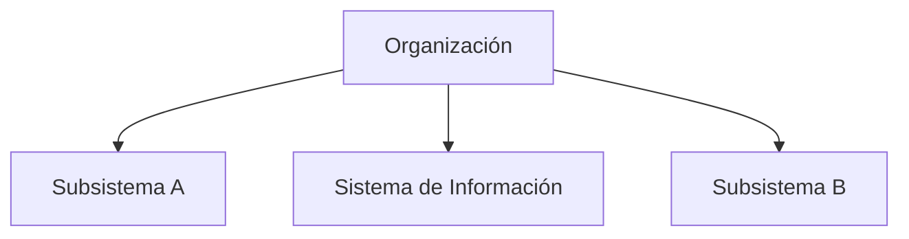

# Mejoras de sistemas

Existen múltiples formas de mejorar [[Sistemas]] ya existentes.

## Optimización de procesos

La optimización de [[Proceso|Procesos]] se puede realizar de varias formas.

- Agilización del [[Proceso]]
- Eliminación de pasos innecesarios o repetidos
- Combinación de [[Proceso|Procesos]]

Esto permite obtener un [[Sistemas|Sistema]] más eficiente y rápido.

## Integración

Un [[Sistema de información]] es [[Subsistema]] de una [[Organización]], que también cuenta con otros [[Subsistema|Subsistemas]].

Se busca mejorar y optimizar la integración entre ellos, y con la propia [[Organización]].

- Reducción de errores de [[Entradas|Entrada]]
- Reducción de [[Salidas]] redundantes
