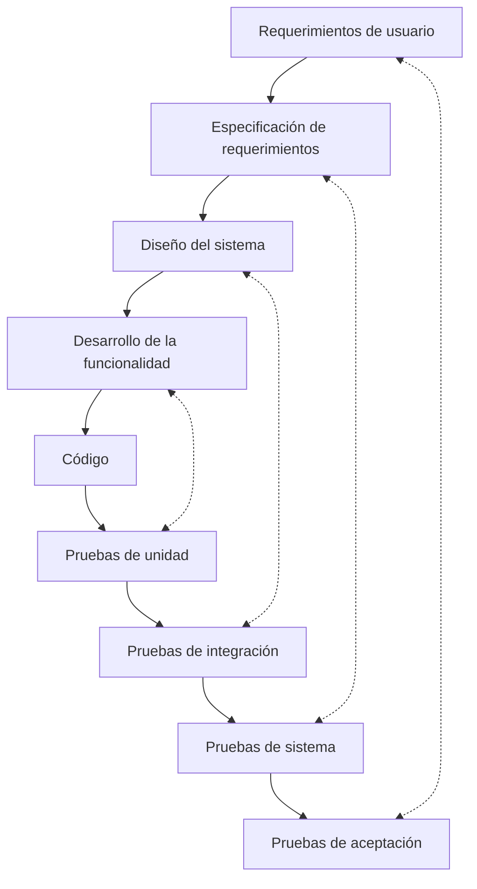

---
aliases:
  - Pruebas de software
created: 2025-05-06 21:56:04
modified: 2025-05-08 11:46:58
title: Prueba de software
---

# Prueba de software

Es el [[Proceso]] ==previamente planificado== de ejecución de un [[Programa propio|Programa]] con la intención de descubrir situaciones donde el comportamiento del software es [[Errores|Erróneo]] o indeseable. Son parte de un [[Proceso]] más amplio de [[Validación y verificación]] de software.

> [!note]
> Las [[Prueba de software|Pruebas]] ocupan un 30-40% del esfuerzo de desarrollo.

> *"Las pruebas pueden mostrar sólo la presencia de errores, mas no su ausencia"*
> 
> - Ian Sommerville

Se busca diseñar las [[Prueba de software|Pruebas]] que tengan la mayor [[Probabilidad]] de encontrar el mayor número de [[Errores]] no encontrados hasta el momento, con la mínima cantidad de esfuerzo y [[Recursos]] posible.

> [!important]
> Con todas las [[Prueba de software|Pruebas de software]] se debe poder realizar un ==seguimiento hasta los [[Requerimientos|Requisitos]]== del cliente. Esto está relacionado con la [[Trazabilidad]].

Normalmente un software comercial pasa por 3 etapas de [[Prueba de software|Prueba]]:

- [[Prueba de desarrollo|Pruebas de desarrollo]]
- [[Versión de prueba|Versiones de prueba]] o [[Versión de prueba|Pruebas de sistema]]
- [[Prueba de usuario|Pruebas de usuario]] o [[Prueba de usuario|Pruebas de aceptación]]

Para ser más efectivas, las [[Prueba de software|Pruebas]] deberían ser conducidas por un [[Grupo Independiente de Prueba]].

> [!danger]
> Se deben evitar los casos de [[Prueba de software|Prueba]] **no documentados** o diseñados **sin cuidado**.
