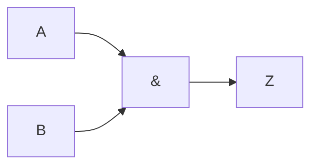
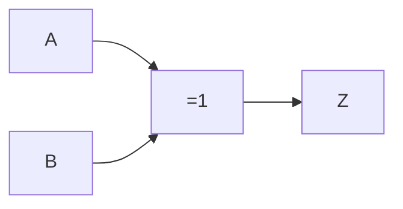

# Compuerta AND

Es una [[Compuertas lógicas|compuerta lógica]], representada por una ==multiplicación== en el álgebra de Boole. Se comporta igual que una [[Conjunción (∧)]].

## Representación simbólica

Podemos representarla de forma simbólica, de tres formas:

- $A \cdot B = Z$
- $A \cap B = Z$
- $A \land B = Z$

## Representación gráfica

Podemos representarla de forma gráfica, de dos formas:

O también como:

## Tabla de verdades

Podemos representarla mediante una [[Tabla de verdades]], igual a la de la de una [[Conjunción (∧)]]:

![[Conjunción (∧)#^fd3490]]

| $A$ | $B$ | $Z = AB$ |
| --- | --- | -------- |
| 0   | 0   | 0        |
| 0   | 1   | 0        |
| 1   | 0   | 0        |
| 1   | 1   | 1        |
