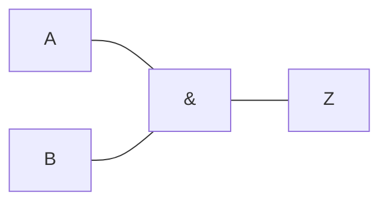

# Compuerta AND

Es una [[Compuertas lógicas|compuerta lógica]], representada por una ==multiplicación== en el álgebra de Boole. Se comporta de forma similar a una [[Conjunción (∧)]] o [[Intersección (∩)]].

## Representación simbólica

Podemos representarla de forma simbólica.

$$
A \cdot B = A \land B = A \cap B = Z
$$

## Representación gráfica

Podemos representarla de forma gráfica:

## Tabla de verdades

Podemos representarla mediante una [[Tabla de verdades]], igual a la de la de una [[Conjunción (∧)]]:

![[Conjunción (∧)#^fd3490]]

| $A$ | $B$ | $Z = A \cdot B$ |
| --- | --- | --------------- |
| 0   | 0   | 0               |
| 0   | 1   | 0               |
| 1   | 0   | 0               |
| 1   | 1   | 1               |
