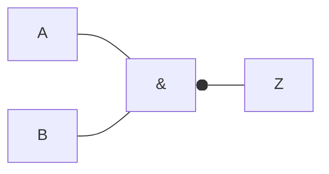

# Compuerta NAND

Es una [[Compuertas lógicas|compuerta lógica]] que representa a una [[Compuerta AND]] seguida por una [[Compuerta NOT]].

## Representación simbólica

Podemos representarla de forma simbólica, de dos formas:

- $\overline{A \cdot B} = Z$
- $-(A \land B) = Z$

## Representación gráfica

Podemos representarla de forma gráfica:

## Tabla de verdades

Podemos representarla mediante una [[Tabla de verdades]].

| $A$ | $B$ | $AB$ | $Z = \overline{AB}$ |
| --- | --- | ---- | ------------------- |
| 0   | 0   | 0    | 1                   |
| 0   | 1   | 0    | 1                   |
| 1   | 0   | 0    | 1                   |
| 1   | 1   | 1    | 0                   |
