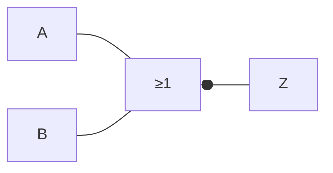

# Compuerta NOR

Es una [[Compuertas lógicas|compuerta lógica]] que representa a una [[Compuerta OR]] seguida por una [[Compuerta NOT]].

## Representación simbólica

Podemos representarla de forma simbólica, de dos formas:

- $\overline{A + B} = Z$
- $-(A \lor B) = Z$

## Representación gráfica

Podemos representarla de forma gráfica, de dos formas:

## Tabla de verdades

Podemos representarla mediante una [[Tabla de verdades]].

| $A$ | $B$ | $A + B$ | $Z = \overline{A + B}$ |
| --- | --- | ------- | ---------------------- |
| 0   | 0   | 0       | 1                      |
| 0   | 1   | 1       | 0                      |
| 1   | 0   | 1       | 0                      |
| 1   | 1   | 1       | 0                      |
