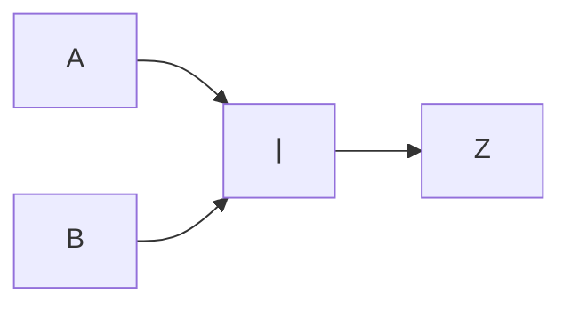
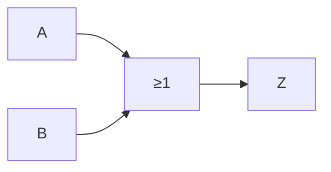

# Compuerta NOT

Es una [[Compuertas lógicas|compuerta lógica]], actúa como un ==inversor==. Se comporta igual que una [[Negación (-)]].

## Representación simbólica

Podemos representarla de forma simbólica, de tres formas:

- $\bar{Z}$
- $-Z$
- $\lnot Z$

## Representación gráfica

Podemos representarla de forma gráfica, de dos formas:

O también como:

## Tabla de verdades

Podemos representarla mediante una [[Tabla de verdades]], igual a la de la de una [[Negación (-)]]:

![[Negación (-)#^f39b71]]

| $Z$ | $\bar{Z}$ |
| --- | --------- |
| 0   | 1         |
| 1   | 0         |
