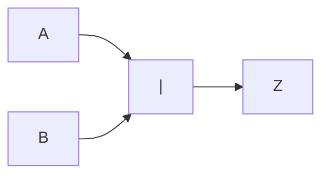
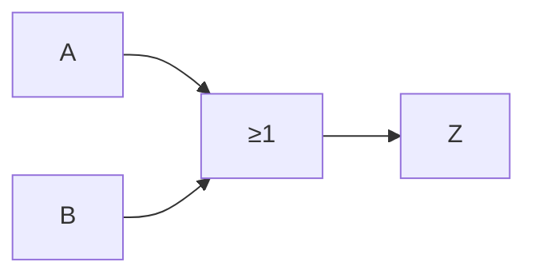

# Compuerta OR

Es una [[Compuertas lógicas|compuerta lógica]], representada por una ==suma== en el álgebra de Boole. Se comporta igual que una [[Disyunción (∨)]].

## Representación simbólica

Podemos representarla de forma simbólica, de tres formas:

- $A + B = Z$
- $A \cup B = Z$
- $A \lor B = Z$

## Representación gráfica

Podemos representarla de forma gráfica, de dos formas:

O también como:

## Tabla de verdades

Podemos representarla mediante una [[Tabla de verdades]], igual a la de la de una [[Disyunción (∨)]]:

![[Disyunción (∨)#^632ed6]]

| $A$ | $B$ | $Z = A + B$ |
| --- | --- | ----------- |
| 0   | 0   | 0           |
| 0   | 1   | 1           |
| 1   | 0   | 1           |
| 1   | 1   | 1           |
