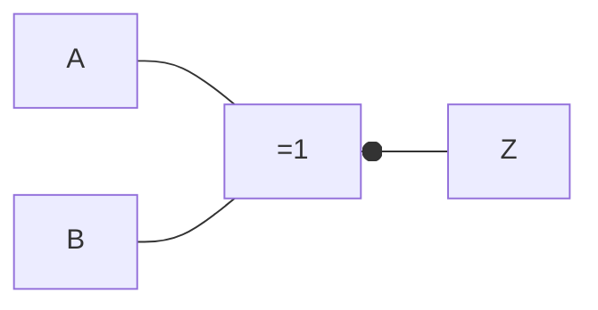

# Compuerta XNOR

Es una [[Compuertas lógicas|compuerta lógica]] que representa a una [[Compuerta XOR]] seguida por una [[Compuerta NOT]]. Se comporta igual que un [[Bicondicional (↔)]].

## Representación simbólica

Podemos representarla de forma simbólica, de dos formas:

- $A \cdot B + \overline{A} \cdot \overline{B} = Z$
- $(A + \overline{B}) \cdot \overline{B} = Z$
- $A \leftrightarrow B = Z$

## Representación gráfica

Podemos representarla de forma gráfica, de dos formas:

## Tabla de verdades

Podemos representarla mediante una [[Tabla de verdades]], igual a la de la de un [[Bicondicional (↔)]]:

![[Bicondicional (↔)#^b9afeb]]

| $A$ | $B$ | $A \cdot B$ | $\overline{A \cdot B}$ | $Z = A \cdot B + \overline{A \cdot B}$ |
| --- | --- | ----------- | ---------------------- | -------------------------------------- |
| 0   | 0   | 0           | 1                      | 0                                      |
| 0   | 1   | 0           | 1                      | 1                                      |
| 1   | 0   | 0           | 1                      | 1                                      |
| 1   | 1   | 1           | 0                      | 0                                      |
