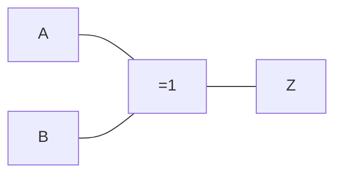

# Compuerta XOR

Es una [[Compuertas lógicas|compuerta lógica]] que se comporta de forma similar a una [[Disyunción exclusiva (⊕)]] o [[Diferencia simétrica]].

## Representación simbólica

Podemos representarla de forma simbólica, de dos formas:

- $\overline{A}B + A\overline{B} = Z$
- $A \oplus B = Z$

## Representación gráfica

Podemos representarla de forma gráfica:

## Tabla de verdades

Podemos representarla mediante una [[Tabla de verdades]], igual a la de la de una [[Disyunción exclusiva (⊕)]]:

![[Disyunción exclusiva (⊕)#^9bd0d6]]

| $A$ | $B$ | $\overline{A}$ | $\overline{B}$ | $\overline{A}B$ | $A\overline{B}$ | $Z = \overline{A}B + A\overline{B}$ |
| --- | --- | -------------- | -------------- | --------------- | --------------- | ----------------------------------- |
| 0   | 0   | 1              | 1              | 0               | 0               | 0                                   |
| 0   | 1   | 1              | 0              | 1               | 0               | 1                                   |
| 1   | 0   | 0              | 1              | 0               | 1               | 1                                   |
| 1   | 1   | 0              | 0              | 0               | 0               | 0                                   |
