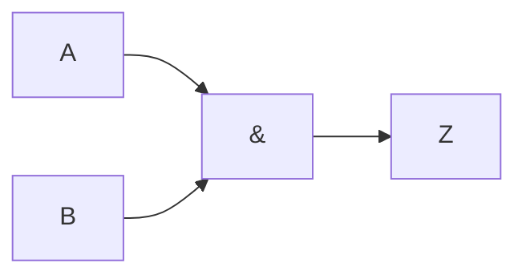
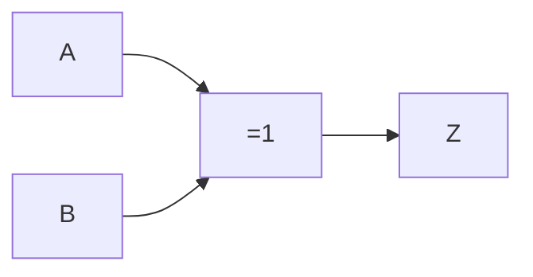

# Intersección (AND)

Únicamente los elementos comunes entre dos o más conjuntos. Se representa con la multiplicación ($A \cdot B$).

Para dos conjuntos $A$ y $B$:

$$
A \cap B = Z
$$

Es equivalente a la compuerta *AND*, y es representada como:

O también como:

## Tabla de verdades

| $A$ | $B$ | $Z=AB=A \land B$ |
| --- | --- | ---------------- |
| 0   | 0   | 0                |
| 0   | 1   | 0                |
| 1   | 0   | 0                |
| 1   | 1   | 1                |
